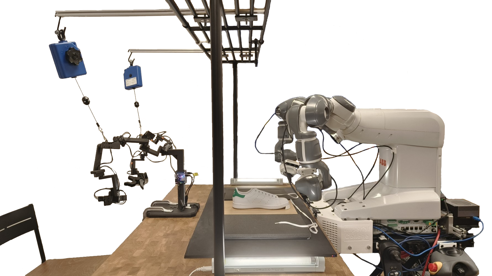

# Interface Matters
This is the repository for paper "**Interface Matters: Comparing First and Third-Person Perspective Interfaces for Bi-Manual Robot Shoe Lacing Behavioural Cloning**" accepted for publication on the 2025 IEEE International Conference on Robotics and Automation (ICRA).

## Demo: Shoe Lacing with GuMi
This demo tests GuMi under the scenario of shoe lacing. The video is replayed at 16x speed.

https://github.com/user-attachments/assets/7c5b7bba-3eb4-41c3-b969-fab2bfed8b5f

## Repo structure
The repository is organized as follows:
- [`gumi/`](gumi/): Contains the 3D models and assembly instructions for the GuMi teleoperation device.
- [`gumi_docker/`](gumi_docker/): Contains the ROS package for GuMi, including the scripts for calibration to publishing ROS commands.



**Note**: This device relies on the [**Externally Guided Motion (EGM)**](https://library.e.abb.com/public/726b2f1b18b24edd8599bfd4eb885553/3HAC073319%20AM%20Externally%20Guided%20Motion%20RW6-en.pdf?x-sign=EcpZvXDes5EjtYp7QXzt2cqU4ENfum8Y7ZxD4SvbcklAzojFplhjLdnTpfQ2cNip) library from ABB. Please check first if EGM is available in your Robotware.

## Acknowledgements
We would like to thank the authors of the following projects for their open-source contributions:
- [GELLO](https://wuphilipp.github.io/gello_site/)
- [kth-yumi](https://github.com/kth-ros-pkg/yumi)
- [abb_robot_driver](https://github.com/ros-industrial/abb_robot_driver)
- [abb_robot_driver_interfaces](https://github.com/ros-industrial/abb_robot_driver_interfaces)
- [abb_libegm](https://github.com/ros-industrial/abb_libegm)
- [abb_librws](https://github.com/ros-industrial/abb_librws)
- [abb_egm_rws_managers](https://github.com/ros-industrial/abb_egm_rws_managers)

## Citation
```
@inproceedings{luo2025interface,
    title={Interface Matters: Comparing First and Third-Person Perspective Interfaces for Bi-Manual Robot Shoe Lacing Behavioural Cloning},
    author={Haining Luo, Rodrigo Chacon Quesada, Fernando Estevez Casado, Nico Lingg, Yiannis Demiris},
    booktitle={2025  IEEE International Conference on Robotics and Automation (ICRA)},
    pages={in print},
    year={2025},
    organization={IEEE}
}
```