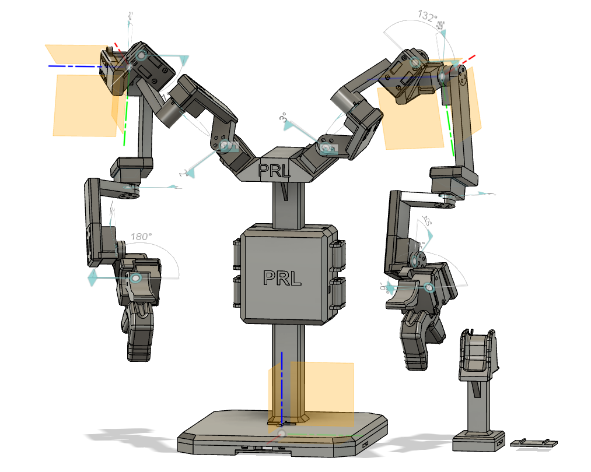

## GuMi: A teleoperation device for the dual-arm robot YuMi

    

This folder contains the stl files and assembly instructions for the GuMi teleoperation device. The complete device is composed of the following 3D printed parts:

- 1x [Base](base/README.md)
- 2x [H2D2 Support](h2d2_support/README.md)
- 1x [H2D2 Cover (Optional)](h2d2_cover/README.md)
- 2x [Arm](arm/README.md)
- 2x [Gripper](gripper/README.md)

Additionally, the following hardware is required:
- 2x H2D2 with Power Hub Board
- 14x Dynamixel XL330-M288-T
- 2x Dynamixel XL330-M077-T
- 2x RS PRO 24W AC/DC Adapter 5V DR Output (or equivalent power supply)
- 2x Aeromotive RB2 Tool Balancer (0.5-0.9kg)
- 1x Kennedy 200mm F-Clamp (or equivalent clamp)

You can start from the [Base](base/README.md).