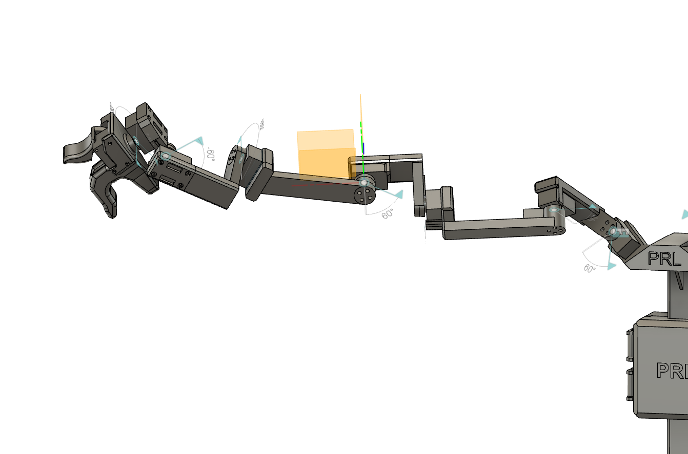

## Arm

    

This folder includes the 3D models and assembly instructions for the 2 arms of the GuMi teleoperation device. 

### Components
- 1x Link 1-6 (Link 7 is combined with the gripper)
- 7x Dynamixel XL330-M288-T

### Assembly Instructions
1. Start from the base of the arm, install the Dynamixel XL330-M288-T and the links in order.
2. Connect the Dynamixel XL330-M288-T motors using the provided cables. The connected ports do not matter.
3. Move on to install the [Gripper](../gripper/README.md) on the end of the arm. 