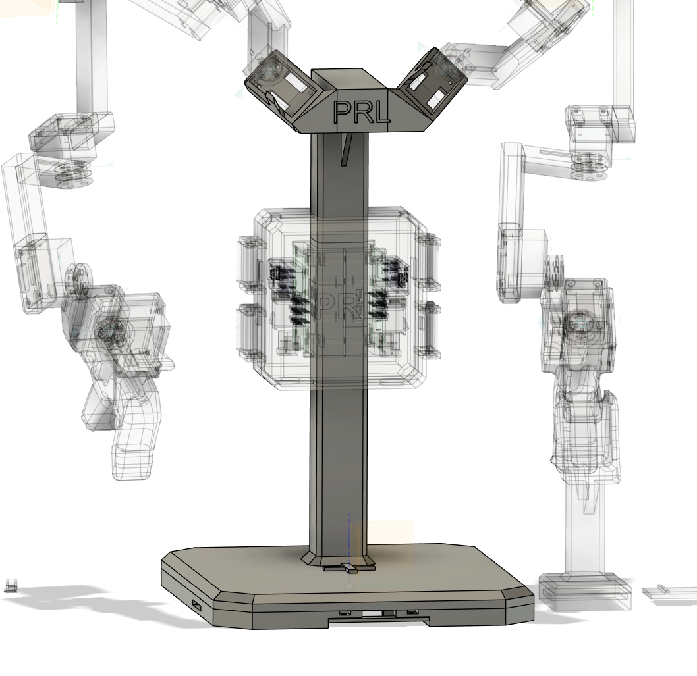

## Base

    

The Base component provides support for the two arms, route for the wires at the bottom, and cursor for the base centre. The H2D2 support is mounted on the middle of the base. The wiring box is press-fitted to cover the wires and the H2D2 boards. 

### Components
- 1x BaseBottom
- 1x BaseTop
- 4x M3x15 screws
- 4x M3 nuts

### Assembly Instructions
1. (Optional) Place the BaseBottom side up, glue the two BaseSupports to the BaseBottom in the same orientation as shown in the image. Fit the H2D2 cables though the BaseSupports and Screw the BaseSupportBridge (The BaseSupports are for asthetic purposes only and not necessary for the structure of the base).
2. Place the BaseTop on top of the BaseBottom and align the holes. Insert 4 M3x15 screws through the holes and knot the screws with M3 nuts.
3. Move on to install the [H2D2 Supports](../h2d2_support/README.md).