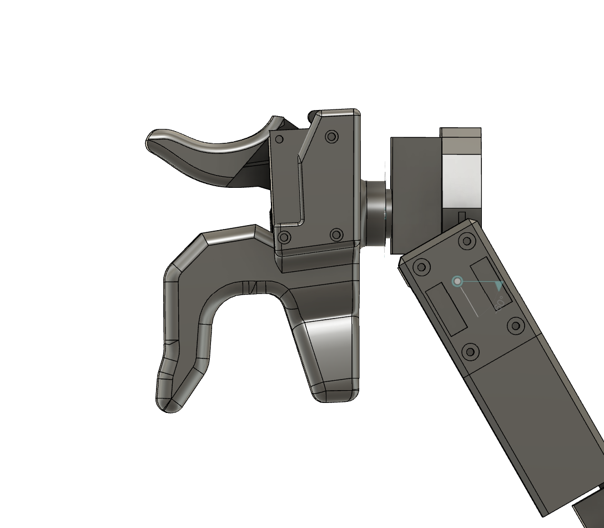

## Gripper

The gripper design is a slightly modified version from the original GELLO project. Please refer to the [GELLO](https://wuphilipp.github.io/gello_site/) project for more information.

    

The Gripper component provides the ability to control the opening and closing of YuMi's SmartGripper. 

### Components
- 1x GripperBase
- 1x GripperTrigger
- 1x Dynamixel XL330-M077-T

### Assembly Instructions
1. Install the GripperBase on the end of the arm using the provided motor screws.
2. Install the Dynamixel XL330-M077-T on the GripperTrigger using the motor screws.
3. Connect the Dynamixel XL330-M077-T motor to the GripperBase using the motor screws.
4. Connect the motor provided cables to the Dynamixel XL330-M077-T motor with the Joint 7 motor.
5. (Optional) Move on to install the [H2D2 Cover](../h2d2_cover/README.md).
