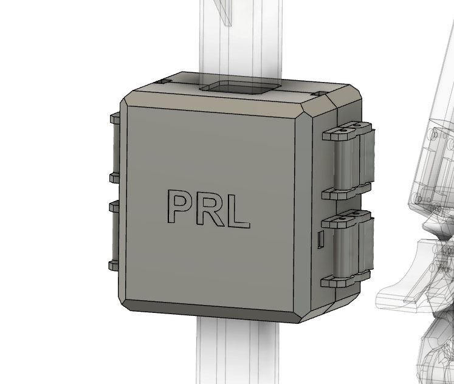

## H2D2 Cover

    

The H2D2Cover component seals electrical circuits and wires inside for the safety and aesthetics purposes. It is mounted on the middle of the base. 

### Components
- 1x H2D2CoverFront
- 1x H2D2CoverBack
- 4x H2D2CoverLatch
- 8x M3x20 screws

### Assembly Instructions
1. Place the latches on the H2D2CoverFront slots with the holes aligned as shown in the image. Insert screws through the holes of the H2D2CoverFront and H2D2CoverBack.
1. Place the H2D2CoverFront outside the H2D2Support and align the cable holes.
1. Close the latches to secure the H2D2CoverFront and H2D2CoverBack together.
1. Connect the USB and power cables to the H2D2 Power Hub Board.