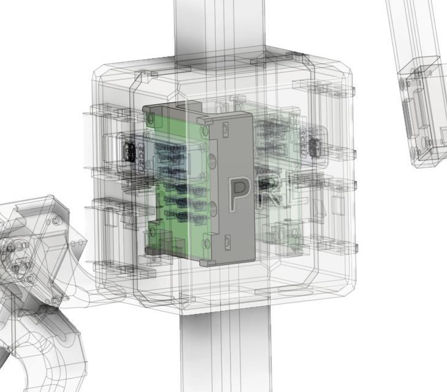

## H2D2 Support

    

The H2D2Support component provides support for the H2D2 boards. The H2D2Support is mounted on the middle of the base. 

### Components
- 2x H2D2Support
- 4x M3x15 screws
- 4x M3 nuts

### Assembly Instructions
1. Place the H2D2Support outside the Base piller and align the holes. 
1. Position the H2D2 Power Hub Board on the H2D2Support and align the holes.
1. Insert 4 M3x15 screws through the holes and knot the screws with M3 nuts.
1. If not using the H2D2 Cover, connect the USB and power cables to the H2D2 Power Hub Board.
1. Make sure the two USB cables connecting the H2D2s are connected to the device running GuMi scripts. If using a laptop, consider using a powered USB hub in case of insufficient motherboard power supply.
1. Move on to install the [Arms](../arm/README.md).
